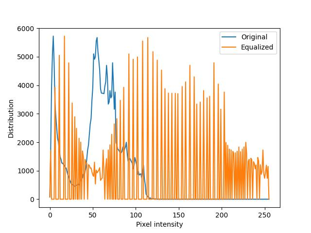
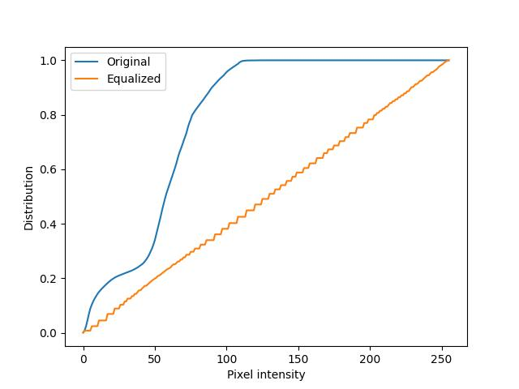

# Image Histogram Equalization with Python
## Introduction
This project is to implement the histogram equalization with Python. You can put the target img in folder `./src`, and set the configurations in `./config`. For details, please refer to the comments in codes.

## Results

## Input and Output
> In the example image, I decreased the brightness of the original image, and converted it to grayscale.

<table border="0">
 <tr>
    <td><b style="font-size:20px">Input image</b></td>
    <td><b style="font-size:20px">Output image</b></td>
 </tr>
 <tr>
    <td></img></td>
    <td></img></td>
 </tr>
</table>

## Analysis
The following two plots compare the PDF (Probability Density Function) and CDF (cumulative distribution function) of input and output images.

As you can see, after applying the histogram equlization, the distrinution of pixel intensity (PDF) becomes more dispersive. And the CDF is uniformly distributed.

<table border="0">
 <tr>
    <td><b style="font-size:20px">PDF</b></td>
    <td><b style="font-size:20px">CDF</b></td>
 </tr>
 <tr>
    <td></img></td>
    <td></img></td>
 </tr>
</table>


## Development Environment
```
Python 3.9.6
MacOS 12.6
```

## How to use it?
1. Install the dependencies
    ```shell
    pip install -r requirements.txt
    ```
2. Update the `config.py` if needed

3. Run the `main.py`
    ```shell
    python main.py
    ```

<style>

td {
    /* border:black thin solid; */
    max-width:50%;
    width:50%;
}

table {
    width:100%;
}

</style>